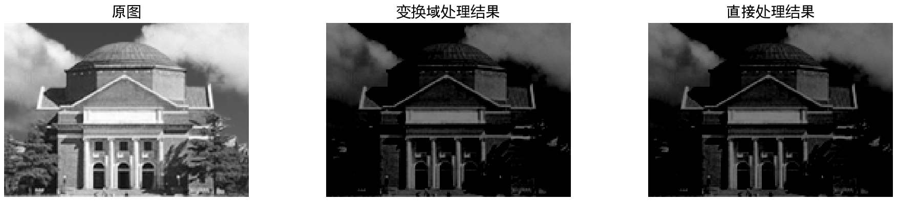

# 图像处理大作业 实验报告

## 第一章 基础知识 练习题

### 1

**MATLAB 提供了图像处理工具箱，在命令窗口输入 `help images` 可查看该工具箱内的所有函数。请阅读并大致了解这些函数的基本功能。**

输出内容略。

### 2

**利用 MATLAB 提供的 Image file I/O 函数分别完成以下处理：**

#### a

**以测试图像的中心为圆心，图像的长和宽中较小值的一半为半径画一个红颜色的圆。**

找到图像的中心坐标和半径，然后调用 `viscircles` 函数。

注意到 `viscircles` 函数的第一个输入参数 `center` 的定义，故而需要令 `center = [width + 1, height + 1] / 2;`。

```matlab
load('hall.mat');

[height, width, ~] = size(hall_color);
center = [width + 1, height + 1] / 2;
radius = min(height, width) / 2;
imshow(hall_color);
viscircles(center, radius, 'Color', 'r');
```


#### b

**将测试图像涂成国际象棋状的“黑白格”的样子，其中“黑”即黑色，“白”则意味着保留原图。**

将图像的奇数行的奇数列和偶数行的偶数列置为 0。

```matlab
load('hall.mat');

hall_color(1:2:end, 1:2:end) = 0;
hall_color(2:2:end, 2:2:end) = 0;
imshow(hall_color);
```


**用一种看图软件浏览上述两个图，看是否达到了目标。**

基本达到了目标。

## 第二章 图像压缩编码 练习题

**本章练习题所用数据均可由 `JpegCoeff.mat` 导入，其内容如表 2.5 所示。本章练习题中“测试图像”指的是 `hall.mat` 中的灰度图像。**

### 1

**图像的预处理是将每个像素灰度值减去 128，这个步骤是否可以在变换域进行？请在测试图像中截取一块验证你的结论。**

若要在变换域进行将每个像素灰度值减去 128 的操作，相当于将该图像的直流分量减去 128。因此对于大小为 $mn$ 的测试图像，只需要将测试图像 DCT 变换的结果的左上角减去 $128 \sqrt{mn}$，即可得到所需结果。

```matlab
load('hall.mat');

dct_hall = dct2(hall_gray);
dct_hall(1, 1) = dct_hall(1, 1) - 128 * sqrt(numel(dct_hall));
hall_gray_ = idct2(dct_hall);
```

得到变换后的图像：



为了使图像更加直观，我使得画出的图像的每个像素的灰度值均在 0 - 255 之间。

与直接处理结果作差：

```matlab
diff = double(hall_gray) - 128 - hall_gray_;
disp(norm(diff));
```

输出结果为 `7.7422e-12`，说明两者几乎一致。

### 2

**请编程实现二维 DCT，并和 MATLAB 自带的库函数 `dct2` 比较是否一致。**

由指导书中的公式 (2.5)，可知，作为线性变换，DCT可以用矩阵算子表示为 $\mathbf{c} = \mathbf{D} \mathbf{p}$。故而需要求出 $\mathbf{D}$。

```matlab
function D = my_dct2_d(N)
    D = zeros(N, N);
    for i = 1:N
        for j = 1:N
            D(i, j) = cos((i - 1) * (j * 2 - 1) * pi / (N * 2));
        end
    end
    D(1, :) = D(1, :) * sqrt(1 / 2);
    D = D * sqrt(2 / N);
end
```

接下来，实现二维 DCT：

```matlab
function dct = my_dct2(p)
    [height, width] = size(p);
    dct = my_dct2_d(height) * double(p) * my_dct2_d(width)';
end
```

最后，和 MATLAB 自带的库函数 `dct2` 比较是否一致：

```matlab
load('hall.mat');

dct1 = dct2(hall_gray);
dct2 = my_dct2(hall_gray);

disp(norm(dct1 - dct2));
```

输出结果为 `2.3631e-10`，说明两者几乎一致。

### 3

**如果将 DCT 系数矩阵中右侧四列的系数全部置零，逆变换后的图像会发生什么变化？选取一块图验证你的结论。如果左侧的四列置零呢？**

```matlab
load('hall.mat');

dct_hall_right = dct2(hall_gray);
dct_hall_right(:, end - 3:end) = 0;
hall_gray_right = idct2(dct_hall_right);

dct_hall_left = dct2(hall_gray);
dct_hall_left(:, 1:4) = 0;
hall_gray_left = idct2(dct_hall_left);
```


为了使图像更加直观，我使得画出的图像的每个像素的灰度值均在 0 - 255 之间。

可以看到，将 DCT 系数矩阵中右侧四列的系数全部置零，逆变换后的图像并不会发生较大的变化，仅有一些较小的失真，这是因为右侧的系数对应的是高频分量，而高频分量对图像的贡献较小。而将左侧的四列置零，逆变换后的图像则会发生较大的变化，这是因为左侧的系数对应的是低频分量，而低频分量对图像的贡献较大。

### 4

**若对 DCT 系数分别做转置、旋转 90 度和旋转 180 度操作（`rot90`），逆变换后恢复的图像有何变化？选取一块图验证你的结论。**

```matlab
load('hall.mat');

dct_hall_transpose = dct2(hall_gray);
dct_hall_transpose = dct_hall_transpose';
hall_gray_transpose = idct2(dct_hall_transpose);

dct_hall_90 = dct2(hall_gray);
dct_hall_90 = rot90(dct_hall_90);
hall_gray_90 = idct2(dct_hall_90);

dct_hall_180 = dct2(hall_gray);
dct_hall_180 = rot90(dct_hall_180, 2);
hall_gray_180 = idct2(dct_hall_180);
```


为了使图像更加直观，我使得画出的图像的每个像素的灰度值均在 0 - 255 之间。

可以看到，对 DCT 系数分别做转置操作相当于对原图像做转置操作。我们可以在数学上证明这一点。由于 $\mathbf{C} = \mathbf{D} \mathbf{P} \mathbf{D}^T$，故而 $\mathbf{C}^T = (\mathbf{D} \mathbf{P} \mathbf{D}^T)^T = \mathbf{D} \mathbf{P}^T \mathbf{D}^T$。

而旋转 90 度和旋转 180 度操作则会使得原先较小的高频分量移动到低频分量位置上，原先较大的低频分量移动到高频分量位置上，因此逆变换后的图像灰度较小，而变化较大。

### 5

**如果认为差分编码是一个系统，请绘出这个系统的频率响应，说明它是一个\_\_\_\_\_（低通、高通、带通、带阻）滤波器。DC 系数先进行差分编码再进行熵编码，说明 DC 系数的\_\_\_\_\_频率分量更多。**

差分：

$$
y[n] = x[n - 1] - x[n]
$$

对其进行 Z 变换得到系统函数：

$$
H(z) = z^{-1} - 1
$$

这是一个高通滤波器。说明 DC 系数的低频频率分量更多。

绘出这个系统的频率响应：

```matlab
freqz([-1, 1]);
```


### 6

**DC 预测误差的值和 Category 值有何关系？如何利用预测误差计算出其 Category？**

观察发现，DC 预测误差的值和 Category 值的关系为：

$$
\text{Category} = \left\lceil \log_2 \left( \left| \text{DC 预测误差} \right| + 1 \right) \right\rceil
$$

利用预测误差计算出其 Category：

```matlab
function category = dc_error_to_category(dc_error)
    category = ceil(log2(abs(dc_error) + 1));
end
```


### 7

**你知道哪些实现 Zig-Zag 扫描的方法？请利用 MATLAB 的强大功能设计一种最佳方法。**

实现 Zig-Zag 扫描的最简单的一种方法是通过循环：

```matlab
function zigzag = zigzag_scan(matrix)
    [height, width] = size(matrix);
    zigzag = zeros(1, height * width);
    i = 1;
    for s = 1:height + width - 1
        if mod(s, 2) == 1
            for y = 1:min(s, width)
                x = s - y + 1;
                if x <= height && y <= width
                    zigzag(i) = matrix(x, y);
                    i = i + 1;
                end
            end
        else
            for x = 1:min(s, height)
                y = s - x + 1;
                if x <= height && y <= width
                    zigzag(i) = matrix(x, y);
                    i = i + 1;
                end
            end
        end
    end
end
```

### 8

**对测试图像分块、DCT 和量化，将量化后的系数写成矩阵的形式，其中每一列为一个块的 DCT 系数 Zig-Zag 扫描后形成的列矢量，第一行为各个块的 DC 系数。**

```matlab
load('hall.mat');
load('JpegCoeff.mat');

block_size = 8;

hall_preprocessed = double(hall_gray) - 128;
[height, width] = size(hall_preprocessed);

height_blocks = ceil(height / block_size);
width_blocks = ceil(width / block_size);

height_extended = height_blocks * block_size;
width_extended = width_blocks * block_size;

result = [];
for i = 1 : height_blocks
    for j = 1 : width_blocks
        block = hall_preprocessed((i - 1) * block_size + 1 : i * block_size, (j - 1) * block_size + 1 : j * block_size);
        dct_block = dct2(block);
        quantized_block = dct_block ./ QTAB;
        zigzag_block = int32(zigzag_scan(quantized_block));
        result = [result, zigzag_block'];
    end
end
```

### 9

**请实现本章介绍的 JPEG 编码（不包括写 JFIF 文件），输出为 DC 系数的码流、AC 系数的码流、图像高度和图像宽度，将这四个变量写入 `jpegcodes.mat` 文件。**

需要对上一题的结果进行进一步处理，得到 DC 系数的码流和 AC 系数的码流。我为此写了一个函数 `jpeg_encode`：

```matlab
function [DC_code, AC_code, height, width] = jpeg_encode(imag, QTAB, DCTAB, ACTAB)
    block_size = 8;

    preprocessed = double(imag) - 128;
    [height, width] = size(preprocessed);
    
    height_blocks = ceil(height / block_size);
    width_blocks = ceil(width / block_size);
    
    result = [];
    for i = 1 : height_blocks
        for j = 1 : width_blocks
            block = preprocessed((i - 1) * block_size + 1 : i * block_size, (j - 1) * block_size + 1 : j * block_size);
            dct_block = dct2(block);
            quantized_block = dct_block ./ QTAB;
            zigzag_block = int32(zigzag_scan(quantized_block));
            result = [result, zigzag_block'];
        end
    end
    
    DC_components = double(result(1, :));
    DC_components = [DC_components(1), -diff(DC_components)];
    DC_code = [];
    category = dc_error_to_category(DC_components);
    for i = 1 : length(DC_components)
        if category(i) == 0
            DC_code = [DC_code, 0, 0];
        else
            huffman = DCTAB(category(i) + 1, 2 : DCTAB(category(i) + 1, 1) + 1);
            binary = dec2bin(abs(DC_components(i))) - '0';
            if (DC_components(i) < 0)
                binary = ~binary;
            end
            DC_code = [DC_code, huffman, binary];
        end
    end
    
    F0 = '11111111001' - '0';
    EOB = '1010' - '0';
    AC_code = [];
    for i = 1 : length(DC_components)
        AC_components = double(result(2 : end, i));
        AC_nonzero = find(AC_components);
        last_index = 0;
        while ~isempty(AC_nonzero)
            run = AC_nonzero(1) - last_index - 1;
            while run >= 16
                AC_code = [AC_code, F0];
                run = run - 16;
            end
            run_size = dc_error_to_category(AC_components(AC_nonzero(1)));
            huffman = ACTAB(run * 10 + run_size, 4 : ACTAB(run * 10 + run_size, 3) + 3);
            binary = dec2bin(abs(AC_components(AC_nonzero(1)))) - '0';
            if (AC_components(AC_nonzero(1)) < 0)
                binary = ~binary;
            end
            AC_code = [AC_code, huffman, binary];
            last_index = AC_nonzero(1);
            AC_nonzero = AC_nonzero(2 : end);
        end
        AC_code = [AC_code, EOB];
    end
end
```

将结果保存到 `jpegcodes.mat` 文件中。

```matlab
[DC_code, AC_code, height, width] = jpeg_encode(hall_gray, QTAB, DCTAB, ACTAB);

save jpegcodes.mat DC_code AC_code height width;
```


### 10

**计算压缩比（输入文件长度 / 输出码流长度），注意转换为相同进制。**

在上一题的基础上，计算压缩比：

```matlab
compress_ratio = (height * width * 8) / (length(DC_code) + length(AC_code));
disp(compress_ratio);
```

结果为 6.4247

### 11

**请实现本章介绍的 JPEG 解码，输入是你生成的 `jpegcodes.mat` 文件。分别用客观（PSNR）和主观方式评价编解码效果如何。**

我写了一个函数 `jpeg_decode`：

```matlab
function jpeg = jpeg_decode(DC_code, AC_code, height, width, QTAB, DCTAB, ACTAB)
    block_size = 8;
      
    height_blocks = ceil(height / block_size);
    width_blocks = ceil(width / block_size);
    block_num = height_blocks * width_blocks;
    
    decoded = zeros(64, block_num);
    
    index = 1;
    [max_category, ~] = size(DCTAB);
    step = DCTAB(:, 1);
    for i = 1 : block_num
        for category = 1 : max_category
            if (DC_code(index : index + step(category) - 1) == DCTAB(category, 2 : step(category) + 1))
                break;
            end
        end
        index = index + step(category);
        binary = DC_code(index : index + category - 2);
        index = index + category - 1;
        if (category > 1)
            if (binary(1) == 0)
                binary = ~binary;
                decoded(1, i) = -binary * 2 .^ (category - 2 : -1 : 0)';
            else
                decoded(1, i) = binary * 2 .^ (category - 2 : -1 : 0)';
            end
        else
            decoded(1, i) = 0;
        end
        if (i > 1)
            decoded(1, i) = decoded(1, i - 1) - decoded(1, i);
        end
    end
    
    F0 = '11111111001' - '0';
    EOB = '1010' - '0';
    index = 1;
    [max_run_size, ~] = size(ACTAB);
    AC_code = [AC_code, zeros(1, 16)];
    for i = 1 : block_num
        sum_run = 1;
        while (sum_run < 64)
            if (AC_code(index : index + 3) == EOB)
                index = index + 4;
                break;
            end
            if (AC_code(index : index + 10) == F0)
                sum_run = sum_run + 16;
                index = index + 11;
                continue;
            end
            for run_size = 1 : max_run_size
                step = ACTAB(run_size, 3);
                if (ACTAB(run_size, 4 : step + 3) == AC_code(index : index + step - 1))
                    break;
                end
            end
            index = index + step;
            run = ACTAB(run_size, 1);
            binary_size = ACTAB(run_size, 2);
            binary = AC_code(index : index + binary_size - 1);
            index = index + binary_size;
            sum_run = sum_run + run + 1;
            if (binary(1) == 0)
                binary = ~binary;
                decoded(sum_run, i) = -binary * 2 .^ (binary_size - 1 : -1 : 0)';
            else
                decoded(sum_run, i) = binary * 2 .^ (binary_size - 1 : -1 : 0)';
            end
        end
    end
    
    jpeg = zeros(height_blocks * 8, width_blocks * 8);
    
    index = 1;
    for i = 1 : 8 : height_blocks * 8
        for j = 1 : 8 : width_blocks * 8
            jpeg(i : i + 7, j : j + 7) = idct2(zigzag_reverse(decoded(:, index)) .* QTAB);
            index = index + 1;
        end
    end
    
    jpeg = uint8(jpeg(1 : height, 1 : width) + 128);
end
```

然后计算 PSNR：

```matlab
hall_jpeg = jpeg_decode(DC_code, AC_code, height, width, QTAB, DCTAB, ACTAB);

MSE = sum(sum((hall_gray - hall_jpeg) .^ 2)) / (height * width);
PSNR = 10 * log10(255 ^ 2 / MSE);
```

PSNR 为 34.8975，说明编解码效果较好。


观察图像发现，JPEG 解码后的图像与原图基本一致，但是细节上有一些失真，符合预期。

### 12

**将量化步长减小为原来的一半，重新编解码。同标准量化步长的情况比较压缩比和图像质量。**

只需要将 `QTAB` 除以 2 即可。

```matlab
[hall_jpeg_2, ~, ~, ~, ~, compress_ratio_2, PSNR_2] = jpeg_process(hall_gray, QTAB ./ 2, DCTAB, ACTAB);
[hall_jpeg, ~, ~, ~, ~, compress_ratio, PSNR] = jpeg_process(hall_gray, QTAB, DCTAB, ACTAB);
```

压缩比变为 4.4097，有所下降，而 PSNR 变为 37.3897，有所上升。说明这样在牺牲空间效率的情况下提高了图像质量。


从图像上也能看出来。

### 13

**看电视时偶尔能看到美丽的雪花图像（见 `snow.mat`），请对其编解码。和测试图像的压缩比和图像质量进行比较，并解释比较结果。**

将上面题目的测试图像替换为雪花即可。

压缩比为 3.6450，PSNR 为 29.5614。可以发现，二者均显著发生下降，说明雪花图像的高频分量信息量较大，而 JPEG 编码对于高频分量信息量较大的图像的压缩效果较差。


从图像上也能看出来，局部存在明显的失真。

## 第三章 信息隐藏 练习题

**本章练习题所用测试图像同上一章。本章练习题所指带隐藏信息可自由选择。**

### 1

**实现本章介绍的空域隐藏方法和提取方法。验证其抗 JPEG 编码能力。**

实现空域隐藏方法：

```matlab
function imag_hide = hide_spatial(imag, info)
    bits = reshape(dec2bin(info, 8)', 1, []) - '0';
    imag_size = numel(imag);
    len = length(bits);
    if (imag_size <= len + 16)
        info_hided = [dec2bin(imag_size - 16, 16) - '0', bits(1 : imag_size - 16)];
    else
        info_hided = [dec2bin(len, 16) - '0', bits];
    end
    cipher = dec2bin(reshape(imag', 1, []), 8);
    cipher(1 : len + 16, 8) = info_hided + '0';
    imag_hide = reshape(bin2dec(cipher), size(imag'))';
end
```

实现空域提取方法：

```matlab
function info = extract_spatial(imag)
    cipher = dec2bin(reshape(imag', 1, []), 8);
    info_hided = cipher(:, 8);
    len = bin2dec(char(info_hided(1 : 16)'));
    imag_size = numel(imag);
    if (imag_size <= len + 16)
        bits = info_hided(17 : imag_size + 16);
    else
        bits = info_hided(17 : len + 16);
    end
    try
        info = char(bin2dec(reshape(bits, 8, [])'))';
    catch
        info = '**Unable to extract info**';
    end
end
```

检验一下：

```matlab
load('hall.mat');
load('JpegCoeff.mat');

info = 'Tsinghua University';

hall_hide = uint8(hide_spatial(hall_gray, info));
info_extract = extract_spatial(hall_hide)
```

输出结果为 `Tsinghua University`，说明空域隐藏方法和提取方法实现正确。

接下来，验证其抗 JPEG 编码能力：

```matlab
[hall_hide_jpeg, ~, ~, ~, ~, ~, ~] = jpeg_process(hall_hide, QTAB, DCTAB, ACTAB);

info_extract_jpeg = extract_spatial(hall_hide_jpeg)
```

输出结果为 `**Unable to extract info**`，说明空域隐藏方法对 JPEG 编码不具有抗性。

另外看一下隐藏前后的图像：


几乎没有区别，做到了隐藏。

### 2

**依次实现本章介绍的三种变换域信息隐藏方法和提取方法，分析嵌密方法的隐蔽性以及嵌密后 JPEG 图像的质量变化和压缩比变化。**

方法 1：同空域方法，用信息位逐一替换掉每个量化后的 DCT 系数的最低位，再行熵编码。

```matlab
function [jpeg, info_extracted, DC_code, AC_code, height, width, compress_ratio, PSNR] = hide_DCT_1(imag, info, QTAB, DCTAB, ACTAB)

    ...

    result = hide_spatial(result, info);
    result(result > 127) = result(result > 127) - 256;

    ...

    info_extracted = extract_spatial(decoded);

    ...

end
```

方法 2：同方法 1，用信息位逐一替换掉若干量化后的 DCT 系数的最低位，再行熵编码。注意不是每个 DCT 系数都嵌入了信息。

```matlab
function [jpeg, info_extracted, DC_code, AC_code, height, width, compress_ratio, PSNR] = hide_DCT_2(imag, info, QTAB, DCTAB, ACTAB)

    ...

    result_clip = result(1 : floor(end / 4), :);
    result_clip = hide_spatial(result_clip, info);
    result_clip(result_clip > 127) = result_clip(result_clip > 127) - 256;
    result(1 : floor(end / 4), :) = result_clip;

    ...

    decoded_clip = decoded(1 : floor(end / 4), :);
    info_extracted = extract_spatial(decoded_clip);

    ...

end
```

方法 3：先将待隐藏信息用 1, -1 的序列表示，再逐一将信息位追加在每个块 Zig-Zag 顺序的最后一个非零 DCT 系数之后；如果原本该图像块的最后一个系数就不为零，那就用信息位替换该系数。

```matlab
function [jpeg, info_extracted, DC_code, AC_code, height, width, compress_ratio, PSNR] = hide_DCT_3(imag, info, QTAB, DCTAB, ACTAB)

    ...

    bits = reshape(dec2bin(info, 8)', 1, []) - '0';
    [len_dct, imag_size] = size(result);
    len = length(bits);
    if (imag_size <= len + 16)
        info_hided = [dec2bin(imag_size - 16, 16) - '0', bits(1 : imag_size - 16)];
    else
        info_hided = [dec2bin(len, 16) - '0', bits];
    end
    info_hided(info_hided == 0) = -1;
    for i = 1 : length(info_hided)
        index = find(result(:, i), 1, 'last');
        if isempty(index)
            result(1, i) = info_hided(i);
        elseif (index == len_dct)
            result(len_dct, i) = info_hided(i);
        else
            result(index + 1, i) = info_hided(i);
        end
    end
    
    ...

    info_hided = [];
    [len_dct, imag_size] = size(result);
    for i = 1 : imag_size
        index = find(result(:, i), 1, 'last');
        if isempty(index)
            info_hided = [info_hided, result(1, i)];
        else
            info_hided = [info_hided, result(index, i)];
        end
    end
    info_hided(info_hided == -1) = 0;
    info_hided = char(info_hided + '0');
    len = bin2dec(char(info_hided(1 : 16)));
    if (imag_size <= len + 16)
        bits = info_hided(17 : imag_size + 16);
    else
        bits = info_hided(17 : len + 16);
    end
    try
        info_extracted = char(bin2dec(reshape(bits, 8, [])'))';
    catch
        info_extracted = '**Unable to extract info**';
    end

    ...

end
```

接下来，分别测试三种方法：

```matlab
load('hall.mat');
load('JpegCoeff.mat');

info = 'Tsinghua University';

[hall_hide_0, ~, ~, ~, ~, compress_ratio_0, PSNR_0] = jpeg_process(hall_gray, QTAB, DCTAB, ACTAB);
[hall_hide_1, info_1, ~, ~, ~, ~, compress_ratio_1, PSNR_1] = hide_DCT_1(hall_gray, info, QTAB, DCTAB, ACTAB);
[hall_hide_2, info_2, ~, ~, ~, ~, compress_ratio_2, PSNR_2] = hide_DCT_2(hall_gray, info, QTAB, DCTAB, ACTAB);
[hall_hide_3, info_3, ~, ~, ~, ~, compress_ratio_3, PSNR_3] = hide_DCT_3(hall_gray, info, QTAB, DCTAB, ACTAB);
```


|  方法  | 压缩比 |  PSNR   |
| :----: | :----: | :-----: |
|  直接  | 6.4247 | 34.8975 |
| 方法 1 | 6.4232 | 34.7881 |
| 方法 2 | 6.4232 | 34.7881 |
| 方法 3 | 6.2983 | 34.1206 |

可以发现，我实现的方法 1 和方法 2 的效果是一样的。这是因为我实现方法 1 的时候就优先修改低频分量，且只修改所需要的长度的内容。而我实现的方法 2 限制了只能修改低频分量。所以，这两个方法的效果是一样的。

此外，几种方法的压缩比和 PSNR 都有所下降，说明嵌密后 JPEG 图像的质量变化和压缩比变化都有所下降。

隐蔽性上，可以发现方法 3 的效果最差，增加了许多噪点，而方法 1 和方法 2 的效果相对较好。这是由于方法 3 主要修改的是高频分量，而非另外两个方法的低频分量。

## 第四章 人脸检测 练习题

### 1

**所给资料 `Faces` 目录下包含从网图中截取的 28 张人脸，试以其作为样本训练人脸标准 $\mathbf{v}$。**

#### a

**样本人脸大小不一，是否需要首先将图像调整为相同大小？**

不需要首先将图像调整为相同大小，因为所提供的思路是用各种颜色出现的频率作为该区域的特征。这就与图像的大小无关。

#### b

**假设 $L$ 分别取 3, 4, 5，所得三个 $\mathbf{v}$ 之间有何关系？**

实现训练函数：

```matlab
function output = face_train(trainset, L)
    if (L < 1 || L > 8 || floor(L) ~= L)
        error('L is illegal');
    end
    output = zeros(1, 2 ^ (3 * L));
    for i = 1 : size(trainset, 1)
        image = imread(trainset(i));
        u = zeros(1, 2 ^ (3 * L));
        R = dec2bin(reshape(image(:, :, 1), 1, []), 8) - '0';
        G = dec2bin(reshape(image(:, :, 2), 1, []), 8) - '0';
        B = dec2bin(reshape(image(:, :, 3), 1, []), 8) - '0';
        c_n = R(:, 1 : L) * 2 .^ (3 * L - 1 : -1 : 2 * L)' + G(:, 1 : L) * 2 .^ (2 * L - 1 : -1 : L)' + B(:, 1 : L) * 2 .^ (L - 1 : -1 : 0)' + 1;
        for n = 1 : length(c_n)
            u(c_n(n)) = u(c_n(n)) + 1;
        end
        u = u / numel(c_n);
        output = output + u;
    end
    output = output / size(trainset, 1);
end
```

训练得到三个 $\mathbf{v}$：

```matlab
traindir = dir("Faces/*.bmp");
trainset = strings(length(traindir), 1);
for i = 1 : length(traindir)
    trainset(i) = strcat(traindir(i).folder, '/', traindir(i).name);
end

v3 = train(trainset, 3);
v4 = train(trainset, 4);
v5 = train(trainset, 5);
```

作图可知，$L$ 越大，颜色信息越细致，但是整体的包络大致是一样的。


### 2

**设计一种从任意大小的图片中检测任意多张人脸的算法并变成实现（输出图像在判定为人脸的位置加上红色的边框）。随意选取一张多人照片（比如支部活动或者足球比赛），对程序进行测试。尝试 $L$ 分别取不同的值，评价检测结果有何区别。**

我们可以将图片先分成若干个小块，然后对每个小块进行检测是否为人脸，最后将检测结果汇总，将连在一起的人脸合并为一张脸。

实现检测函数：

```matlab
function imag_marked = face_detect(imag, v, L, precision)
    if (L < 1 || L > 8 || floor(L) ~= L)
        error('L is illegal');
    end
    [height, width, ~] = size(imag);
    block_size = 32;
    height_blocks = ceil(height / block_size);
    width_blocks = ceil(width / block_size);
    block_is_face = false([height_blocks, width_blocks]);
    faces = [];

    for i = 1 : height_blocks
        for j = 1 : width_blocks
            block = imag((i - 1) * block_size + 1 : min(i * block_size, height), (j - 1) * block_size + 1 : min(j * block_size, width), :);
            block_v = zeros(1, 2 ^ (3 * L));
            R = dec2bin(reshape(block(:, :, 1), 1, []), 8) - '0';
            G = dec2bin(reshape(block(:, :, 2), 1, []), 8) - '0';
            B = dec2bin(reshape(block(:, :, 3), 1, []), 8) - '0';
            c_n = R(:, 1 : L) * 2 .^ (3 * L - 1 : -1 : 2 * L)' + G(:, 1 : L) * 2 .^ (2 * L - 1 : -1 : L)' + B(:, 1 : L) * 2 .^ (L - 1 : -1 : 0)' + 1;
            for n = 1 : length(c_n)
                block_v(c_n(n)) = block_v(c_n(n)) + 1;
            end
            block_v = block_v / numel(c_n);
            distance = 1 - sum(sqrt(block_v .* v), 'all');
            block_is_face(i, j) = distance < precision;
        end
    end

    block_is_face = bwareaopen(block_is_face, 9);

    label = bwlabel(block_is_face);
    num = max(label, [], 'all');
    imag_marked = imag;
    if num > 0
        for index = 1 : num
            [x, y] = find(label == index);
            x1 = min(x); x2 = max(x);
            y1 = min(y); y2 = max(y);
            faces = [faces; x1, y1, x2, y2];
            imag_marked = insertShape(imag_marked, 'Rectangle', [(y1 - 1) * block_size + 1, (x1 - 1) * block_size + 1, (y2 - y1 + 1) * block_size, (x2 - x1 + 1) * block_size], 'Color', 'red', 'LineWidth', 8);
        end
    end
end
```

在汇总的时候，可以删去那些连在一起的数量较少的人脸块，这样可以减小误差。

随便从互联网上找来一张图片进行测试：

```matlab
traindir = dir("Faces/*.bmp");
trainset = strings(length(traindir), 1);
for i = 1 : length(traindir)
    trainset(i) = strcat(traindir(i).folder, '/', traindir(i).name);
end

v3 = face_train(trainset, 3);
v4 = face_train(trainset, 4);
v5 = face_train(trainset, 5);

imag = imread('test_image.png');

face3 = face_detect(imag, v3, 3, 0.4);
face4 = face_detect(imag, v4, 4, 0.55);
face5 = face_detect(imag, v5, 5, 0.7);
```


可以发现，实现相同的效果时，$L$ 越大，检测的精度要求就越低。这是因为 $L$ 越大，颜色信息越细致。

### 3

**对上述图像分别进行如下处理后**

**(a) 顺时针旋转 90°（`imrotate`）；**

**(b) 保持高度不变，宽度拉伸为原来的 2 倍（`imresize`）；**

**(c) 适当改变颜色（`imadjust`）；**

**再试试你的算法检测结果如何？并分析所得结果。**

为了方便起见与控制变量，我们只对 $L = 5$ 的情况进行测试。通过以下方法变换测试图像：

```matlab
imag_rotated = imrotate(imag, 90);
imag_resized = imresize(imag, [size(imag, 1), size(imag, 2) * 2]);
imag_colored = imadjust(imag, [0.2, 0.2, 0.2; 0.8, 0.8, 0.8]);
```


可以发现，顺时针旋转 90° 和保持高度不变，宽度拉伸为原来的 2 倍对于检测结果影响较小，而适当改变颜色对于检测结果影响较大。这是因为我们仅仅通过颜色来判断某个区域是否是人脸。颜色改变后，测试信息的颜色与训练信息的颜色差距较大，导致检测结果不准确。

### 4

**如果可以重新选择人脸样本训练标准，你觉得应该如何选取？**

我觉得应该更多考虑人脸的形状和轮廓、五官的位置等，而不仅仅是颜色。通过颜色训练对于不同肤色的人脸来说误差较大。要提取人脸的形状和轮廓，可以使用例如 Haar 特征之类的方法。Haar 特征使用检测窗口中指定位置的相邻矩形，计算每一个矩形的像素和并取其差值，然后用这些差值来对图像的子区域进行分类，可以很好地提取人脸的形状和轮廓。
